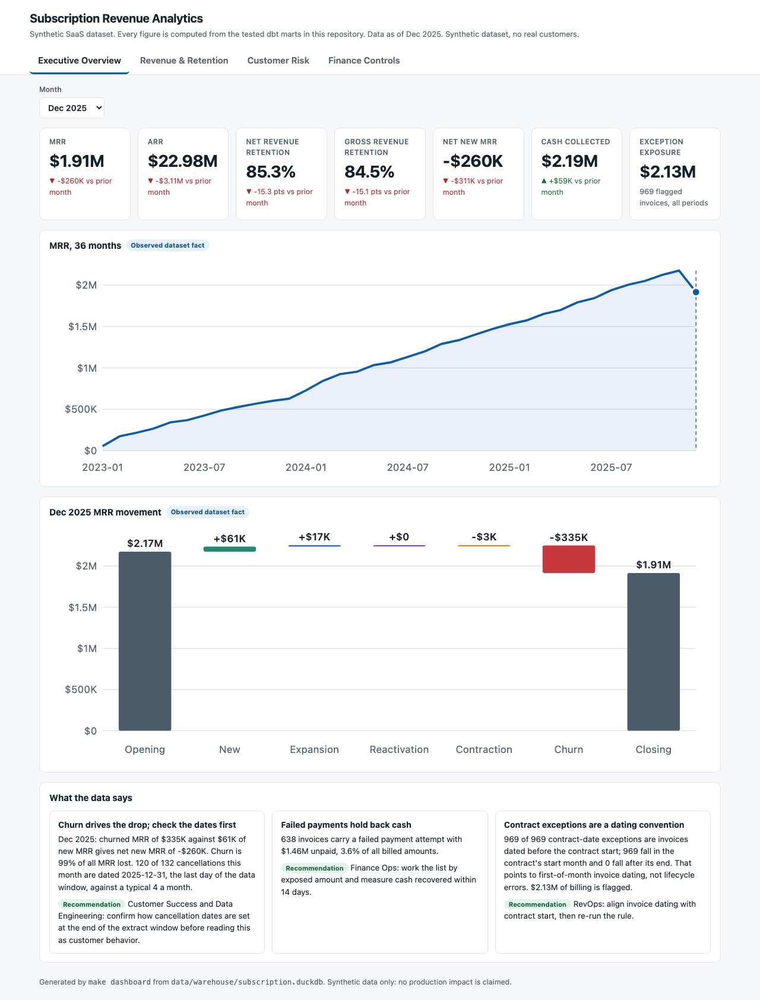
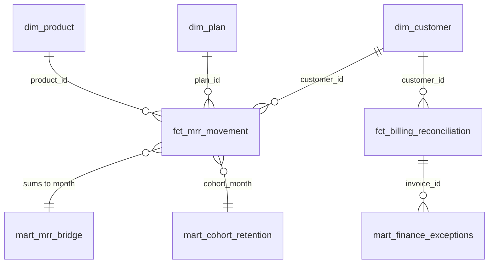

# Subscription Revenue Analytics | SQL, dbt, Python & BI Dashboard

[](https://github.com/VijayChamakuri/subscription-revenue-intelligence/actions/workflows/ci.yml)
[](LICENSE)

> Built a tested SaaS revenue analytics system that reconciles MRR, detects billing leakage and data-quality defects, scores churn risk, and serves a four-page dashboard where every number ties back to the warehouse.

**Synthetic data.** Confidential SaaS billing data is not available, so a seeded generator encodes documented business rules, planted defects, drift, missing values and label noise. Findings describe this dataset only. [Why synthetic and what is planted](docs/data_generation_rules.md).



**Open the dashboard:** clone the repo and open [`dashboard/index.html`](dashboard/index.html) in a browser (single offline file). Pages: [Executive](dashboard/screenshots/01_executive.png), [Revenue & Retention](dashboard/screenshots/02_revenue_retention.png), [Customer Risk](dashboard/screenshots/03_customer_risk.png), [Finance Controls](dashboard/screenshots/04_finance_controls.png). A Power BI report is not included; see [why](docs/dashboard.md#power-bi).

## Three things the data says

| | Finding | What to do |
|---|---|---|
| **December churn** | December 2025 shows $335K churned MRR against $61K new, net new MRR of -$260K. But 120 of 132 cancellations are dated 2025-12-31, the last day of the data window, against about 4 in a typical month. | Do not report this as customer behavior until cancellation dating at the window edge is confirmed. |
| **Failed payments** | 638 invoices have a failed payment attempt: $1.46M unpaid, 3.6% of everything billed. | Work the list largest first and measure cash recovered within 14 days. |
| **Contract exceptions** | 969 invoices are flagged as dated before their contract. All 969 fall in the contract's start month and none after its end, because invoices are dated the first of the month. | Align invoice dating with contract start, then rerun the rule. |

The first and third are data-quality diagnoses, not business problems: both trace to date handling in the generator. That is the point of the checks.

## Stack

| Core analyst stack | Extended implementation (optional) |
|---|---|
| SQL and dbt (34 models, 77 tests), DuckDB | PySpark and a Hive-compatible table for the 600K usage events |
| Python: pandas, scikit-learn, statsmodels | R survival analysis as an independent cross-check |
| Offline HTML dashboard with a Node-run measure library | Airflow DAG for orchestration |
| Excel reconciliation workbook (live formulas) | |
| GitHub Actions on Python 3.11 and 3.12 | |

The core path needs only `uv` and Node. [Extended stack details](docs/implementation_status.md).

## Business questions

Why did MRR change (Finance, RevOps)? Do invoices, payments, refunds and revenue tie out (Finance)? Which accounts need contact first (Customer Success)? Which numbers can be trusted (data owners)? [Stakeholder map](docs/stakeholder_question_map.md) and [decision log](docs/decision_log.md).

## Data model



`fct_mrr_movement` is one row per month, customer, product and plan. Grains and keys for every model: [data model](docs/data_model.md).

## Findings and recommendations

Labels: **Fact** is observed in the dataset, **Model** is an estimate, **Scenario** is simulated.

| Type | Result | Owner and action | How to validate |
|---|---|---|---|
| Fact | MRR bridge reconciles to $0.00 in all 36 months | Finance: block reporting if a check fails | Bridge variance cases in the evidence file |
| Fact | 638 open invoices, $1,461,681.54 unpaid | Finance Ops: work by unpaid amount, largest first | Cash recovered within 14 days |
| Fact | Started subscriptions cancel at 30.3% (SMB), 20.6% (mid-market), 13.8% (enterprise) | Customer Success: focus retention capacity on SMB | Recompute from `stg_subscriptions` |
| Model | Churn score: ROC-AUC 0.633, PR-AUC 0.031 against a 1.9% base rate | Customer Success: prioritize, do not automate | Calibration and lift on the dashboard |
| Scenario | At the cost-selected 4% threshold the held-out net value is about -$2K | Customer Success and Finance: do not scale outreach yet; run a holdout pilot | Incremental renewal versus control |
| Model | Forecasts: MRR WAPE 1.4% (drift method); churned MRR WAPE 94%, so it is not forecastable | FP&A: use MRR forecasts as descriptive point estimates, not intervals | Rolling-origin backtest |

## SQL example

The movement classification behind the bridge, simplified from the [full model](dbt/models/marts/revenue/fct_mrr_movement.sql):

```sql
with movement_base as (
  select month_start, customer_id, product_id, plan_id, mrr as closing_mrr,
         lag(mrr, 1, 0) over (partition by customer_id, product_id, plan_id
                              order by month_start) as opening_mrr,
         count_if(mrr > 0) over (
           partition by customer_id, product_id, plan_id order by month_start
           rows between unbounded preceding and 1 preceding) as prior_active_months
  from int_customer_product_monthly_mrr
)
select *, closing_mrr - opening_mrr as mrr_change,
  case
    when opening_mrr = 0 and closing_mrr > 0 and coalesce(prior_active_months, 0) = 0 then 'new'
    when opening_mrr = 0 and closing_mrr > 0 then 'reactivation'
    when opening_mrr > 0 and closing_mrr = 0 then 'churn'
    when closing_mrr > opening_mrr then 'expansion'
    when closing_mrr < opening_mrr then 'contraction'
    else 'no_change' end as movement_type
from movement_base;
```

## Validation proof

| Check | Result |
|---|---|
| Dashboard measures tied to warehouse SQL | 128 of 128, [evidence](dashboard/validation_evidence.csv) |
| dbt build | 111 of 111 (34 models, 77 tests) |
| Adversarial source tests | Duplicates, refund over payment, currency mismatch, overlapping contracts, early payment, missing dimensions, bad dates |
| Python | Ruff and mypy clean; tests pass with coverage report |
| Finance workbook | Formulas evaluated with an independent engine: all checks pass |

CI runs the same commands and uploads dbt docs and validation files as artifacts. Full table: [implementation status](docs/implementation_status.md). Dashboard checks: [QA checklist](dashboard/qa_checklist.md).

## Quick start

```bash
git clone https://github.com/VijayChamakuri/subscription-revenue-intelligence.git && cd subscription-revenue-intelligence
uv sync --extra dev
make pipeline
```

Requires Python 3.11 or 3.12, `uv` and Node 18 or newer. `make pipeline` generates data, validates sources, builds the warehouse, runs dbt, exports, builds and verifies the dashboard, builds the workbook, then lints, type-checks and tests. Targets: `make setup`, `make build`, `make test`, `make dashboard`, `make dashboard-export`, `make clean`.

## 90-second review path

[This README](#three-things-the-data-says), then the [dashboard](dashboard/index.html), then one model ([`fct_mrr_movement.sql`](dbt/models/marts/revenue/fct_mrr_movement.sql)), one test ([`assert_mrr_bridge_rolls_forward.sql`](dbt/tests/assert_mrr_bridge_rolls_forward.sql)), then the [decision log](docs/decision_log.md).

## Repository map

```text
dashboard/   Offline dashboard, screenshots, validation evidence, QA checklist
dbt/         Staging, intermediate, dimensions, facts, marts, tests
docs/        Data model, rules, decisions, dictionaries, implementation status
excel/       Finance reconciliation workbook
src/         Generation, validation, modeling, dashboard build and checks
sql/         Stakeholder queries
spark/ r/ airflow/ hive/   Optional extended implementation
powerbi/     Power BI specification (no .pbix)
tests/       Python and dashboard tests
```

## Limits

Synthetic data cannot show real impact, and no result here should be read as such. Logo retention appears only as cohorts; LTV, CAC payback, renewal rate, ARPA and marketing return are roadmap definitions with no mart and are never displayed. BigQuery and Power BI were not run. See [limitations](docs/limitations_and_ethics.md) and [analytical design](docs/analytical_design.md).

MIT licensed. See [CONTRIBUTING](CONTRIBUTING.md).
