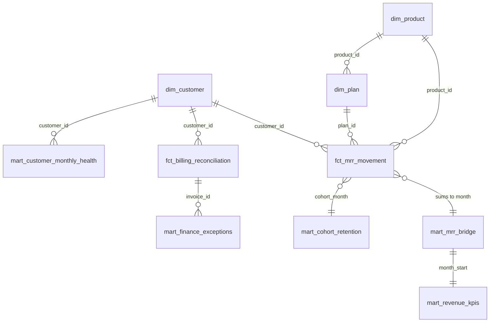

# Data Model

Grain of every certified model. The pipeline diagram lives in [architecture.md](architecture.md).

| Model | Grain | Primary key | Status |
|---|---|---|---|
| `dim_customer` | one row per customer | `customer_id` | Certified |
| `dim_plan`, `dim_product` | one row per plan, product | `plan_id`, `product_id` | Certified |
| `fct_mrr_movement` | month x customer x product x plan | `month_start, customer_id, product_id, plan_id` | Certified |
| `mart_mrr_bridge` | month | `month_start` | Certified |
| `mart_revenue_kpis` | month | `month_start` | Certified |
| `mart_cohort_retention` | acquisition cohort x months since start | `cohort_month, months_since_start` | Certified |
| `fct_billing_reconciliation` | invoice | `invoice_id` | Certified |
| `mart_finance_exceptions` | invoice x rule | `invoice_id, exception_type` | Certified |
| `mart_customer_monthly_health` | month x customer | `month_start, customer_id` | Certified |
| `mart_channel_efficiency` | month x channel | `month_start, channel_id` | Certified |

Roadmap metrics (LTV, CAC payback, renewal rate, ARPA, time to value, pipeline coverage, feature adoption,
marketing return) are defined in the [metric dictionary](metric_dictionary.md) but have no tested mart and are
never shown on the dashboard or workbook.

## Why DuckDB

DuckDB runs the whole warehouse in a single file with no credentials, which keeps the repository reproducible in
CI. The SQL is ANSI-leaning and uses a few DuckDB functions (`date_diff`, `count_if`, `generate_series`), so moving
to another warehouse needs a dialect pass. This repository has not been executed on BigQuery or any other
warehouse and does not claim to have been.
