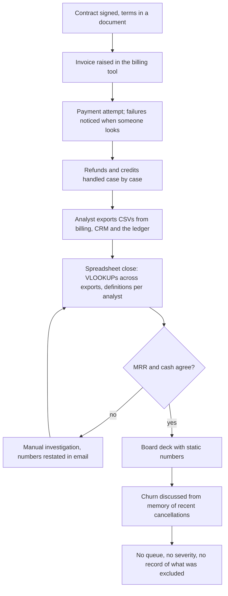
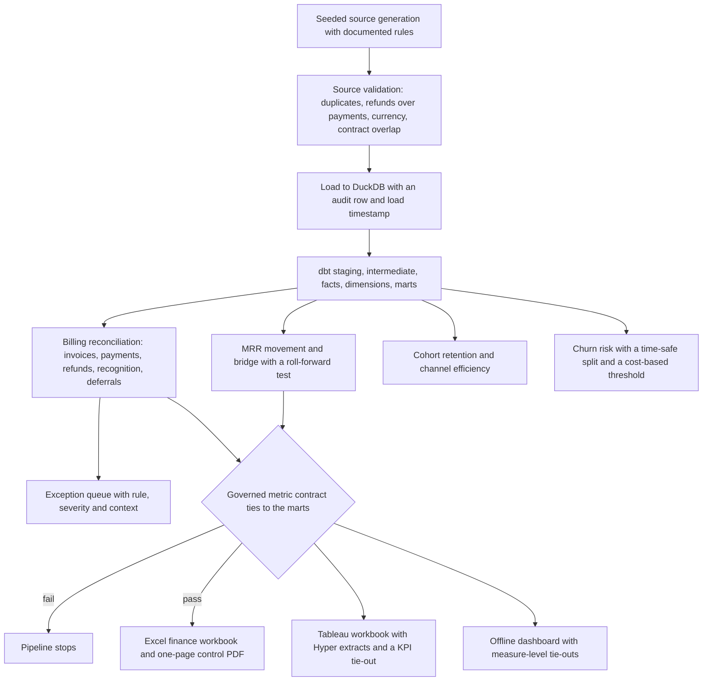

# Process map: order to cash

All project data is synthetic. Outputs describe patterns detected in the generated dataset, not real company outcomes.

The as-is map is the manual close this project replaces. The to-be map is what this repository does today, and every automated step names the file that implements it.

## As-is

Pain points: retention defined differently by Finance and RevOps, failed payments found late, exceptions with no owner or severity, and a deck whose numbers cannot be traced back to a record.

## To-be

## Step to implementation

| To-be step | Implemented by | Control that proves it |
|---|---|---|
| Source generation | `src/generation/generate.py` | `tests/test_generation.py::test_generation_is_reproducible_and_valid` |
| Source validation | `src/validation/validate_sources.py` | `tests/test_adversarial_sources.py::test_refund_exceeding_payment` |
| Load with audit row | `src/ingestion/load_duckdb.py` | `tests/test_run_audit.py::test_loader_writes_audit_row_and_loaded_at_on_every_contract_view` |
| MRR movement and bridge | `dbt/models/marts/revenue/fct_mrr_movement.sql`, `dbt/models/marts/revenue/mart_mrr_bridge.sql` | dbt `assert_mrr_bridge_rolls_forward` |
| Revenue KPIs | `dbt/models/marts/revenue/mart_revenue_kpis.sql` | `tests/test_semantic_layer.py::test_every_metric_ties_to_its_mart_and_stays_in_bounds` |
| Billing reconciliation | `dbt/models/marts/finance/fct_billing_reconciliation.sql` | dbt `assert_invoice_arithmetic` |
| Exception queue | `dbt/models/marts/finance/mart_finance_exceptions.sql` | `tests/dashboard/test_dashboard.py::test_exception_exposure_counts_each_invoice_once` |
| Cohort retention | `dbt/models/marts/growth/mart_cohort_retention.sql` | dbt `assert_cohorts_cover_all_customers` |
| Churn risk | `src/modeling/churn.py` | dbt `assert_no_temporal_health_leakage`, `tests/modeling/test_churn.py::test_temporal_split_has_no_overlap` |
| Governed metric contract | `metrics/semantic_layer.yml`, `src/validation/semantic_layer.py` | `artifacts/semantic_layer_validation.csv` |
| Excel workbook and control PDF | `src/excel/build_workbook.py` | `tests/test_excel_workbook.py::test_only_scenario_inputs_are_editable`, `reports/finance_control_summary.pdf` |
| Tableau workbook | `src/tableau/build.py`, `src/tableau/twb.py` | `tableau/validation_evidence.csv` |
| Offline dashboard | `src/dashboard/build.py` | `dashboard/validation_evidence.csv` |

## What the to-be map does not do

Collections, dunning workflow and tax determination are not modeled. Revenue recognition follows a simplified synthetic schedule and is not an audited GAAP treatment ([limitations](limitations_and_ethics.md)). Nothing here estimates recovered cash or reduced churn.
